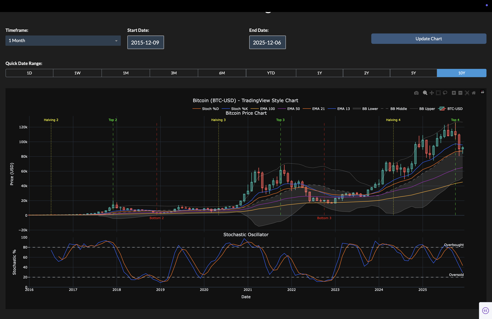

# Bitcoin Quantitative Trading Chart

A TradingView-style Bitcoin chart visualization with technical indicators, Bitcoin halving signals, and interactive controls.



## Features

- **Interactive Web Interface**: Full-featured Dash web application with dark theme
- **Timeframe Selection**: Choose from 4h, 1d, 1w, or 1m intervals (default: 1m)
- **Date Range Picker**: Select custom start and end dates for analysis
- **Quick Date Range Presets**: One-click presets (1D, 1W, 1M, 3M, 6M, YTD, 1Y, 2Y, 5Y, 10Y) with default of 10Y
- **Candlestick Chart**: Interactive Bitcoin price chart with TradingView-style styling
- **Bollinger Bands**: Upper, middle, and lower bands (20-period, 2 std dev)
- **Exponential Moving Averages (EMAs)**:
  - EMA 13 (Blue)
  - EMA 21 (Orange)
  - EMA 50 (Purple)
  - EMA 100 (Yellow/Amber)
- **Stochastic Oscillator**: %K and %D lines (5, 3, 3) with overbought/oversold levels at 80 and 20
- **Bitcoin Halving Signals**:
  - **Halving Dates**: Yellow dotted vertical lines marking all Bitcoin halving events (2012, 2016, 2020, 2024)
  - **Top Signals**: Green dashed vertical lines marking predicted tops (~518 days / 17 months after each halving)
  - **Bottom Signals**: Red dashed vertical lines marking predicted bottoms (~883 days / 29 months after each halving)
  - All signals are automatically aligned to the nearest candlestick for perfect visual alignment

## Installation

This project uses `uv` for dependency management. Install dependencies with:

```bash
uv sync
```

## Usage

Run the script to start the web application:

```bash
uv run python main.py
```

The application will start a local web server at `http://127.0.0.1:8050`. Open this URL in your browser to access the interactive chart interface.

### Using the Interface

1. **Select Timeframe**: Choose your preferred timeframe from the dropdown (4h, 1d, 1w, 1m)
   - Default: **1 Month (1m)**
2. **Pick Date Range**:
   - Use the date pickers to select custom start and end dates, OR
   - Click one of the quick preset buttons (1D, 1W, 1M, 3M, 6M, YTD, 1Y, 2Y, 5Y, 10Y)
   - Default: **10 Years (10Y)**
3. **Update Chart**: Click the "Update Chart" button to refresh the chart with your selections

The chart updates dynamically based on your selections, showing all technical indicators and Bitcoin halving signals calculated for the selected timeframe and date range. Vertical lines for halving events and signals are automatically displayed when they fall within the selected date range.

## Technical Details

### Supported Timeframes

- **4 Hours (4h)**: Resampled from 1-hour data
- **1 Day (1d)**: Daily candlesticks
- **1 Week (1w)**: Weekly candlesticks
- **1 Month (1m)**: Monthly candlesticks (default)

### Bitcoin Halving Signals

The application includes historical Bitcoin halving dates and calculated signals:

- **Halving Dates**:

  - November 28, 2012
  - July 9, 2016
  - May 11, 2020
  - April 20, 2024

- **Top Signals**: Calculated as 518 days (approximately 17 months) after each halving date
- **Bottom Signals**: Calculated as 883 days (approximately 29 months) after each halving date

All signals are automatically aligned to the nearest candlestick timestamp for perfect visual alignment with the price chart.

### Data Source

Bitcoin price data is fetched from Yahoo Finance using the `yfinance` library. The application supports custom date ranges and automatically handles data resampling for the 4-hour timeframe. All technical indicators (EMAs, Bollinger Bands, Stochastic) are calculated manually using pandas and numpy for reliability and performance.

## Dependencies

- `yfinance`: Bitcoin price data fetching
- `pandas`: Data manipulation
- `plotly`: Interactive chart visualization
- `numpy`: Numerical computations
- `dash`: Web application framework
- `dash-bootstrap-components`: UI components for Dash
